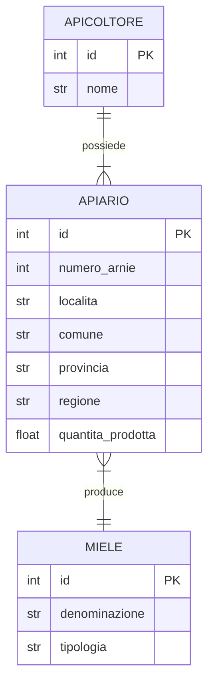

```mermaid
    erDiagram
        MIELE {
            int id PK
            str denominazione
            str tipologia
            }

        APIARIO {
            int id PK
            int numero_arnie
            str localita
            str comune
            str provincia
            str regione
            float quantita_prodotta
            }

        APICOLTORE {
            int id PK
            str nome
            }

APIARIO }|--|| MIELE: produce
APICOLTORE ||--|{ APIARIO: possiede
```