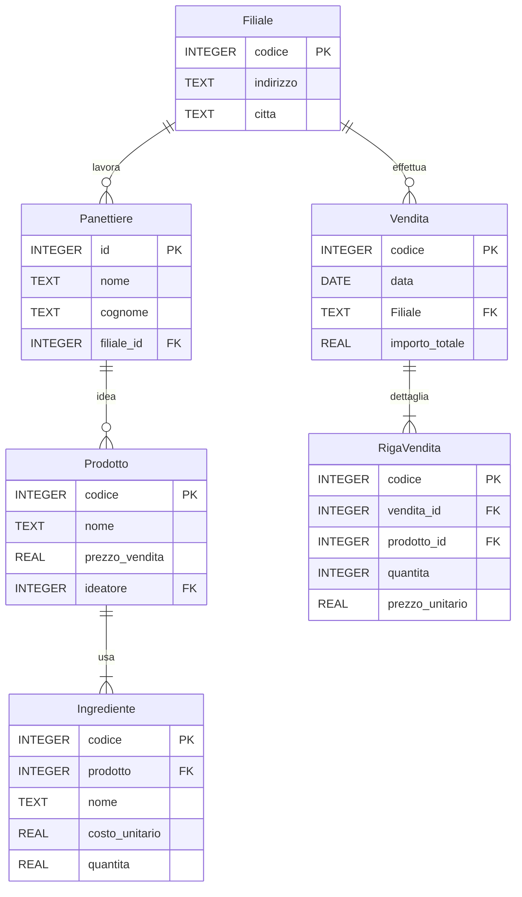

```mermaid
erDiagram

    Filiale {
        INTEGER codice PK
        TEXT indirizzo
        TEXT citta
        }

    Panettiere {
        INTEGER id PK
        TEXT nome
        TEXT cognome
        INTEGER filiale_id FK
        }

    Prodotto {
        INTEGER codice PK
        TEXT nome
        REAL prezzo_vendita
        INTEGER ideatore FK    
        }

    Ingrediente {
        INTEGER codice PK
        INTEGER prodotto FK
        TEXT nome
        REAL costo_unitario
        REAL quantita
        }

    Vendita {
        INTEGER codice PK
        DATE data
        TEXT Filiale FK
        REAL importo_totale
        }

    RigaVendita {
        INTEGER codice PK
        INTEGER vendita_id FK
        INTEGER prodotto_id FK
        INTEGER quantita
        REAL prezzo_unitario
    }
    
    Filiale ||--o{ Panettiere : "lavora"
    Filiale ||--o{ Vendita : "effettua"
    Vendita ||--|{ RigaVendita : "dettaglia"
    Panettiere ||--o{ Prodotto : "idea"
    Prodotto ||--|{ Ingrediente : "usa"
    
    %% In una vendita ci deve essere almeno una riga vendita perchè si è venduto almeno un prodotto
```